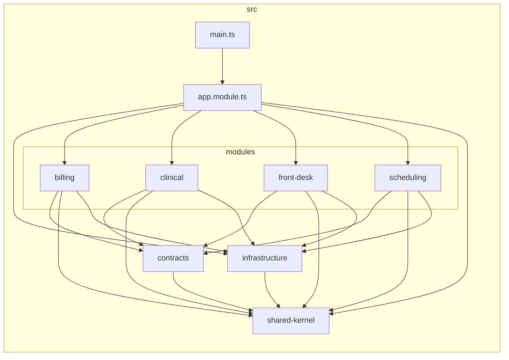

# Grafo de dependências por camada

Gerado por `npm run arch:graph:contexts` a partir do código (dependency-cruiser). Não edite à mão.

```mermaid
flowchart LR

subgraph src["src"]
  src_app_module_ts["app.module.ts"]
  src_contracts["contracts"]
  src_infrastructure["infrastructure"]
  src_main_ts["main.ts"]
  subgraph src_modules["modules"]
    src_modules_billing["billing"]
    src_modules_clinical["clinical"]
    src_modules_front_desk["front-desk"]
    src_modules_scheduling["scheduling"]
  end
  src_shared_kernel["shared-kernel"]
end
src_app_module_ts-->src_infrastructure
src_app_module_ts-->src_modules_billing
src_app_module_ts-->src_modules_clinical
src_app_module_ts-->src_modules_front_desk
src_app_module_ts-->src_modules_scheduling
src_app_module_ts-->src_shared_kernel
src_contracts-->src_shared_kernel
src_infrastructure-->src_shared_kernel
src_main_ts-->src_app_module_ts
src_modules_billing-->src_contracts
src_modules_billing-->src_shared_kernel
src_modules_billing-->src_infrastructure
src_modules_clinical-->src_contracts
src_modules_clinical-->src_shared_kernel
src_modules_clinical-->src_infrastructure
src_modules_front_desk-->src_contracts
src_modules_front_desk-->src_shared_kernel
src_modules_front_desk-->src_infrastructure
src_modules_scheduling-->src_contracts
src_modules_scheduling-->src_shared_kernel
src_modules_scheduling-->src_infrastructure
```
