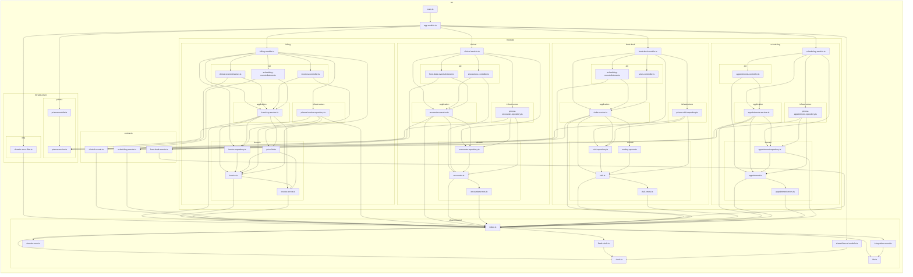

# Grafo de dependências (arquivos)

Gerado por `npm run arch:graph` a partir do código (dependency-cruiser). Não edite à mão.

```mermaid
flowchart LR

subgraph src["src"]
  src_app_module_ts["app.module.ts"]
  subgraph src_infrastructure["infrastructure"]
    subgraph src_infrastructure_http["http"]
      src_infrastructure_http_domain_error_filter_ts["domain-error.filter.ts"]
    end
    subgraph src_infrastructure_prisma["prisma"]
      src_infrastructure_prisma_prisma_module_ts["prisma.module.ts"]
      src_infrastructure_prisma_prisma_service_ts["prisma.service.ts"]
    end
  end
  subgraph src_shared_kernel["shared-kernel"]
    src_shared_kernel_index_ts["index.ts"]
    src_shared_kernel_clock_ts["clock.ts"]
    src_shared_kernel_domain_error_ts["domain-error.ts"]
    src_shared_kernel_fixed_clock_ts["fixed-clock.ts"]
    src_shared_kernel_ids_ts["ids.ts"]
    src_shared_kernel_integration_event_ts["integration-event.ts"]
    src_shared_kernel_shared_kernel_module_ts["shared-kernel.module.ts"]
  end
  subgraph src_modules["modules"]
    subgraph src_modules_billing["billing"]
      src_modules_billing_billing_module_ts["billing.module.ts"]
      subgraph src_modules_billing_api["api"]
        src_modules_billing_api_clinical_events_listener_ts["clinical-events.listener.ts"]
        src_modules_billing_api_invoices_controller_ts["invoices.controller.ts"]
        src_modules_billing_api_scheduling_events_listener_ts["scheduling-events.listener.ts"]
      end
      subgraph src_modules_billing_application["application"]
        src_modules_billing_application_invoicing_service_ts["invoicing.service.ts"]
      end
      subgraph src_modules_billing_domain["domain"]
        src_modules_billing_domain_invoice_ts["invoice.ts"]
        src_modules_billing_domain_invoice_errors_ts["invoice.errors.ts"]
        src_modules_billing_domain_invoice_repository_ts["invoice.repository.ts"]
        src_modules_billing_domain_price_list_ts["price-list.ts"]
      end
      subgraph src_modules_billing_infrastructure["infrastructure"]
        src_modules_billing_infrastructure_prisma_invoice_repository_ts["prisma-invoice.repository.ts"]
      end
    end
    subgraph src_modules_clinical["clinical"]
      src_modules_clinical_clinical_module_ts["clinical.module.ts"]
      subgraph src_modules_clinical_api["api"]
        src_modules_clinical_api_encounters_controller_ts["encounters.controller.ts"]
        src_modules_clinical_api_front_desk_events_listener_ts["front-desk-events.listener.ts"]
      end
      subgraph src_modules_clinical_application["application"]
        src_modules_clinical_application_encounters_service_ts["encounters.service.ts"]
      end
      subgraph src_modules_clinical_domain["domain"]
        src_modules_clinical_domain_encounter_ts["encounter.ts"]
        src_modules_clinical_domain_encounter_errors_ts["encounter.errors.ts"]
        src_modules_clinical_domain_encounter_repository_ts["encounter.repository.ts"]
      end
      subgraph src_modules_clinical_infrastructure["infrastructure"]
        src_modules_clinical_infrastructure_prisma_encounter_repository_ts["prisma-encounter.repository.ts"]
      end
    end
    subgraph src_modules_front_desk["front-desk"]
      src_modules_front_desk_front_desk_module_ts["front-desk.module.ts"]
      subgraph src_modules_front_desk_api["api"]
        src_modules_front_desk_api_scheduling_events_listener_ts["scheduling-events.listener.ts"]
        src_modules_front_desk_api_visits_controller_ts["visits.controller.ts"]
      end
      subgraph src_modules_front_desk_application["application"]
        src_modules_front_desk_application_visits_service_ts["visits.service.ts"]
      end
      subgraph src_modules_front_desk_domain["domain"]
        src_modules_front_desk_domain_visit_ts["visit.ts"]
        src_modules_front_desk_domain_visit_errors_ts["visit.errors.ts"]
        src_modules_front_desk_domain_visit_repository_ts["visit.repository.ts"]
        src_modules_front_desk_domain_waiting_queue_ts["waiting-queue.ts"]
      end
      subgraph src_modules_front_desk_infrastructure["infrastructure"]
        src_modules_front_desk_infrastructure_prisma_visit_repository_ts["prisma-visit.repository.ts"]
      end
    end
    subgraph src_modules_scheduling["scheduling"]
      src_modules_scheduling_scheduling_module_ts["scheduling.module.ts"]
      subgraph src_modules_scheduling_api["api"]
        src_modules_scheduling_api_appointments_controller_ts["appointments.controller.ts"]
      end
      subgraph src_modules_scheduling_application["application"]
        src_modules_scheduling_application_appointments_service_ts["appointments.service.ts"]
      end
      subgraph src_modules_scheduling_domain["domain"]
        src_modules_scheduling_domain_appointment_ts["appointment.ts"]
        src_modules_scheduling_domain_appointment_errors_ts["appointment.errors.ts"]
        src_modules_scheduling_domain_appointment_repository_ts["appointment.repository.ts"]
      end
      subgraph src_modules_scheduling_infrastructure["infrastructure"]
        src_modules_scheduling_infrastructure_prisma_appointment_repository_ts["prisma-appointment.repository.ts"]
      end
    end
  end
  subgraph src_contracts["contracts"]
    src_contracts_clinical_events_ts["clinical.events.ts"]
    src_contracts_scheduling_events_ts["scheduling.events.ts"]
    src_contracts_front_desk_events_ts["front-desk.events.ts"]
  end
  src_main_ts["main.ts"]
end
src_app_module_ts-->src_infrastructure_http_domain_error_filter_ts
src_app_module_ts-->src_infrastructure_prisma_prisma_module_ts
src_app_module_ts-->src_modules_billing_billing_module_ts
src_app_module_ts-->src_modules_clinical_clinical_module_ts
src_app_module_ts-->src_modules_front_desk_front_desk_module_ts
src_app_module_ts-->src_modules_scheduling_scheduling_module_ts
src_app_module_ts-->src_shared_kernel_shared_kernel_module_ts
src_infrastructure_http_domain_error_filter_ts-->src_shared_kernel_index_ts
src_shared_kernel_index_ts-->src_shared_kernel_clock_ts
src_shared_kernel_index_ts-->src_shared_kernel_domain_error_ts
src_shared_kernel_index_ts-->src_shared_kernel_fixed_clock_ts
src_shared_kernel_index_ts-->src_shared_kernel_ids_ts
src_shared_kernel_index_ts-->src_shared_kernel_integration_event_ts
src_shared_kernel_fixed_clock_ts-->src_shared_kernel_clock_ts
src_shared_kernel_integration_event_ts-->src_shared_kernel_ids_ts
src_infrastructure_prisma_prisma_module_ts-->src_infrastructure_prisma_prisma_service_ts
src_modules_billing_billing_module_ts-->src_modules_billing_api_clinical_events_listener_ts
src_modules_billing_billing_module_ts-->src_modules_billing_api_invoices_controller_ts
src_modules_billing_billing_module_ts-->src_modules_billing_api_scheduling_events_listener_ts
src_modules_billing_billing_module_ts-->src_modules_billing_application_invoicing_service_ts
src_modules_billing_billing_module_ts-->src_modules_billing_domain_invoice_repository_ts
src_modules_billing_billing_module_ts-->src_modules_billing_domain_price_list_ts
src_modules_billing_billing_module_ts-->src_modules_billing_infrastructure_prisma_invoice_repository_ts
src_modules_billing_api_clinical_events_listener_ts-->src_modules_billing_application_invoicing_service_ts
src_modules_billing_api_clinical_events_listener_ts-->src_contracts_clinical_events_ts
src_modules_billing_application_invoicing_service_ts-->src_modules_billing_domain_invoice_ts
src_modules_billing_application_invoicing_service_ts-->src_modules_billing_domain_invoice_errors_ts
src_modules_billing_application_invoicing_service_ts-->src_modules_billing_domain_invoice_repository_ts
src_modules_billing_application_invoicing_service_ts-->src_modules_billing_domain_price_list_ts
src_modules_billing_application_invoicing_service_ts-->src_shared_kernel_index_ts
src_modules_billing_domain_invoice_ts-->src_modules_billing_domain_invoice_errors_ts
src_modules_billing_domain_invoice_ts-->src_shared_kernel_index_ts
src_modules_billing_domain_invoice_errors_ts-->src_shared_kernel_index_ts
src_modules_billing_domain_invoice_repository_ts-->src_modules_billing_domain_invoice_ts
src_modules_billing_domain_price_list_ts-->src_modules_billing_domain_invoice_ts
src_modules_billing_domain_price_list_ts-->src_modules_billing_domain_invoice_errors_ts
src_contracts_clinical_events_ts-->src_shared_kernel_index_ts
src_modules_billing_api_invoices_controller_ts-->src_modules_billing_application_invoicing_service_ts
src_modules_billing_api_invoices_controller_ts-->src_modules_billing_domain_invoice_ts
src_modules_billing_api_scheduling_events_listener_ts-->src_modules_billing_application_invoicing_service_ts
src_modules_billing_api_scheduling_events_listener_ts-->src_contracts_scheduling_events_ts
src_contracts_scheduling_events_ts-->src_shared_kernel_index_ts
src_modules_billing_infrastructure_prisma_invoice_repository_ts-->src_modules_billing_domain_invoice_ts
src_modules_billing_infrastructure_prisma_invoice_repository_ts-->src_modules_billing_domain_invoice_repository_ts
src_modules_billing_infrastructure_prisma_invoice_repository_ts-->src_infrastructure_prisma_prisma_service_ts
src_modules_billing_infrastructure_prisma_invoice_repository_ts-->src_shared_kernel_index_ts
src_modules_clinical_clinical_module_ts-->src_modules_clinical_api_encounters_controller_ts
src_modules_clinical_clinical_module_ts-->src_modules_clinical_api_front_desk_events_listener_ts
src_modules_clinical_clinical_module_ts-->src_modules_clinical_application_encounters_service_ts
src_modules_clinical_clinical_module_ts-->src_modules_clinical_domain_encounter_repository_ts
src_modules_clinical_clinical_module_ts-->src_modules_clinical_infrastructure_prisma_encounter_repository_ts
src_modules_clinical_api_encounters_controller_ts-->src_modules_clinical_application_encounters_service_ts
src_modules_clinical_api_encounters_controller_ts-->src_modules_clinical_domain_encounter_ts
src_modules_clinical_application_encounters_service_ts-->src_modules_clinical_domain_encounter_ts
src_modules_clinical_application_encounters_service_ts-->src_modules_clinical_domain_encounter_repository_ts
src_modules_clinical_application_encounters_service_ts-->src_contracts_clinical_events_ts
src_modules_clinical_application_encounters_service_ts-->src_shared_kernel_index_ts
src_modules_clinical_domain_encounter_ts-->src_modules_clinical_domain_encounter_errors_ts
src_modules_clinical_domain_encounter_ts-->src_shared_kernel_index_ts
src_modules_clinical_domain_encounter_errors_ts-->src_shared_kernel_index_ts
src_modules_clinical_domain_encounter_repository_ts-->src_modules_clinical_domain_encounter_ts
src_modules_clinical_api_front_desk_events_listener_ts-->src_modules_clinical_application_encounters_service_ts
src_modules_clinical_api_front_desk_events_listener_ts-->src_contracts_front_desk_events_ts
src_contracts_front_desk_events_ts-->src_shared_kernel_index_ts
src_modules_clinical_infrastructure_prisma_encounter_repository_ts-->src_modules_clinical_domain_encounter_ts
src_modules_clinical_infrastructure_prisma_encounter_repository_ts-->src_modules_clinical_domain_encounter_repository_ts
src_modules_clinical_infrastructure_prisma_encounter_repository_ts-->src_infrastructure_prisma_prisma_service_ts
src_modules_front_desk_front_desk_module_ts-->src_modules_front_desk_api_scheduling_events_listener_ts
src_modules_front_desk_front_desk_module_ts-->src_modules_front_desk_api_visits_controller_ts
src_modules_front_desk_front_desk_module_ts-->src_modules_front_desk_application_visits_service_ts
src_modules_front_desk_front_desk_module_ts-->src_modules_front_desk_domain_visit_repository_ts
src_modules_front_desk_front_desk_module_ts-->src_modules_front_desk_infrastructure_prisma_visit_repository_ts
src_modules_front_desk_api_scheduling_events_listener_ts-->src_modules_front_desk_application_visits_service_ts
src_modules_front_desk_api_scheduling_events_listener_ts-->src_contracts_scheduling_events_ts
src_modules_front_desk_application_visits_service_ts-->src_modules_front_desk_domain_visit_ts
src_modules_front_desk_application_visits_service_ts-->src_modules_front_desk_domain_visit_repository_ts
src_modules_front_desk_application_visits_service_ts-->src_modules_front_desk_domain_waiting_queue_ts
src_modules_front_desk_application_visits_service_ts-->src_contracts_front_desk_events_ts
src_modules_front_desk_application_visits_service_ts-->src_shared_kernel_index_ts
src_modules_front_desk_domain_visit_ts-->src_modules_front_desk_domain_visit_errors_ts
src_modules_front_desk_domain_visit_ts-->src_shared_kernel_index_ts
src_modules_front_desk_domain_visit_errors_ts-->src_shared_kernel_index_ts
src_modules_front_desk_domain_visit_repository_ts-->src_modules_front_desk_domain_visit_ts
src_modules_front_desk_domain_waiting_queue_ts-->src_modules_front_desk_domain_visit_ts
src_modules_front_desk_api_visits_controller_ts-->src_modules_front_desk_application_visits_service_ts
src_modules_front_desk_infrastructure_prisma_visit_repository_ts-->src_modules_front_desk_domain_visit_ts
src_modules_front_desk_infrastructure_prisma_visit_repository_ts-->src_modules_front_desk_domain_visit_repository_ts
src_modules_front_desk_infrastructure_prisma_visit_repository_ts-->src_infrastructure_prisma_prisma_service_ts
src_modules_scheduling_scheduling_module_ts-->src_modules_scheduling_api_appointments_controller_ts
src_modules_scheduling_scheduling_module_ts-->src_modules_scheduling_application_appointments_service_ts
src_modules_scheduling_scheduling_module_ts-->src_modules_scheduling_domain_appointment_repository_ts
src_modules_scheduling_scheduling_module_ts-->src_modules_scheduling_infrastructure_prisma_appointment_repository_ts
src_modules_scheduling_api_appointments_controller_ts-->src_modules_scheduling_application_appointments_service_ts
src_modules_scheduling_api_appointments_controller_ts-->src_modules_scheduling_domain_appointment_ts
src_modules_scheduling_application_appointments_service_ts-->src_modules_scheduling_domain_appointment_ts
src_modules_scheduling_application_appointments_service_ts-->src_modules_scheduling_domain_appointment_repository_ts
src_modules_scheduling_application_appointments_service_ts-->src_contracts_scheduling_events_ts
src_modules_scheduling_application_appointments_service_ts-->src_shared_kernel_index_ts
src_modules_scheduling_domain_appointment_ts-->src_modules_scheduling_domain_appointment_errors_ts
src_modules_scheduling_domain_appointment_ts-->src_shared_kernel_index_ts
src_modules_scheduling_domain_appointment_errors_ts-->src_shared_kernel_index_ts
src_modules_scheduling_domain_appointment_repository_ts-->src_modules_scheduling_domain_appointment_ts
src_modules_scheduling_domain_appointment_repository_ts-->src_shared_kernel_index_ts
src_modules_scheduling_infrastructure_prisma_appointment_repository_ts-->src_modules_scheduling_domain_appointment_ts
src_modules_scheduling_infrastructure_prisma_appointment_repository_ts-->src_modules_scheduling_domain_appointment_repository_ts
src_modules_scheduling_infrastructure_prisma_appointment_repository_ts-->src_infrastructure_prisma_prisma_service_ts
src_shared_kernel_shared_kernel_module_ts-->src_shared_kernel_clock_ts
src_main_ts-->src_app_module_ts
```
